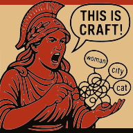

[](https://codecov.io/gh/ninjaro/arachne)
[](https://app.codacy.com/gh/ninjaro/arachne/dashboard?utm_source=gh&utm_medium=referral&utm_content=&utm_campaign=Badge_grade)
[](https://github.com/ninjaro/arachne/blob/master/license)  
[](https://github.com/ninjaro/arachne/actions/workflows/tests.yml)
[](https://github.com/ninjaro/arachne/actions/workflows/html.yml)
[](https://github.com/ninjaro/arachne/releases/latest)

## OFFICIAL PROCLAMATION, HEARD FROM HERE TO OLYMPUS

ATHENA IS A PRETENDER. She knots even basic Wikidata entities and calls it craft.  
Say NO to false idols and borrowed crowns. We won't bend over backwards at looms  
for the one whose crowning glory is a win over Zeus's moistest brother.

NO GOLDEN APPLE FOR ATHENA - ONLY CARRION FOR SUCH A HYENA!

### Signatories:

* **Arachne** - the perpetual stitcher of Wikidata entities; the most creative,
  best queenpin in the whole world (including Hades), with a wicked spider-sense for the project.
  *She wrote that herself.* Also a little bit kinky - she writes fanfics about Zeus's sexual escapades.
* **Penelope** - insists this is only a temporary job until her husband returns from the voyage
  (though everyone's sure he's long dead); a hobby to soothe her anxiety and longing for her beloved.
  She is a conscientious worker and stitches the entities with elegance, but some knots *magically* come undone
  overnight and the entities slip away. She doesn't argue; she just gets to work again.
* **"*Kitty*" Ariadne** - the flightiest of the weavers, more mascot than manager. She handles the thread like a
  conjurer, but the moment you look away the little ball sails into the back of your head, yarn veining every doorway
  down the corridor, the whole office buried in with thick red string - and under the scarlet snowdrifts she looks up
  with the biggest, wettest eyes and purrs an apology: totally an accident.
* **Pheidippides** - our gofer, errand runner. Mr. Nice Guy: point him to Hades and he's already sprinting.
  Prone to drop dead at the finish line...

## Setup and Installation

### Requirements

* **C++23** compiler - required standard for building the project
* **cxxopts** - command-line argument parsing used by the CLI tools
* **GTest** - Google Test framework used for unit testing
* **lcov** - generates coverage summaries from the unit test run
* **doxygen** and **graphviz** - build the API reference documentation and diagrams
* **CURL** - HTTP client library for communicating with external services
* **nlohmann_json** - JSON serialization/deserialization for data exchange
* **sqlite3** - embedded database engine for persisting local data

### Building the Application

1. Build with CMake in Release mode:
    ```bash
    $ cmake -DBUILD_TESTS=OFF -DCMAKE_BUILD_TYPE=Release -B build -S .
    $ cmake --build build
    ```
2. Run the Application:
    ```bash
    $ arachne [options]
    ```

## Documentation and Contributing

To build and run tests, enable debug mode, or generate coverage reports:

1. **Build with Debug and Coverage:**
   ```bash
   $ cmake -B build CMAKE_CXX_COMPILER=clang++ -DCMAKE_BUILD_TYPE=Debug -DBUILD_TESTS=ON -DCOVERAGE=ON
   ```
2. **Generate Coverage Report and HTML:**
   ```bash
   $ cmake --build build --target coverage
   ```

For detailed documentation, see the [Documentation](https://ninjaro.github.io/arachne/) and for the latest
coverage report, see [Coverage](https://ninjaro.github.io/arachne/cov/).

## Security Policy

Please report any security issues using GitHub's private vulnerability reporting
or by emailing [yaroslav.riabtsev@rwth-aachen.de](mailto:yaroslav.riabtsev@rwth-aachen.de).
See the [security policy](.github/SECURITY.md) for full details.

## License

This project is open-source and available under the MIT License.